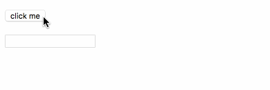

# @cloukit/common

### Install

```bash
npm install --save @cloukit/common
```

### Usage

Import the Modules and declare `@NgModule`-imports:

```typescript
import { HasFocusModule, ClickOutsideModule } from '@cloukit/common';

import { BrowserModule } from '@angular/platform-browser';
import { NgModule } from '@angular/core';
import { FormsModule } from '@angular/forms';
import { HttpModule } from '@angular/http';
import { AppComponent } from './app.component';

@NgModule({
  declarations: [ AppComponent ],
  imports: [ BrowserModule, FormsModule, HttpModule,
             HasFocusModule, ClickOutsideModule ],
  providers: [ ],
  bootstrap: [ AppComponent ]
})
export class AppModule { }
```

&nbsp;

#### HasFocusModule - Directive HasFocus

Import the 
This directive let's you focus an e.g. input-textfield when clicking some button.
Therefore `[cloukitHasFocus]="boolean"` can be used on the input-textfield.

The following example demonstrates that:

  * :sparkles: [Plunkr Demo](https://plnkr.co/edit/hGOcz0?p=preview)
  * :sparkles: GIF-Preview
    * 

```typescript
import { Component } from '@angular/core';

@Component({
  selector: 'itsememario',
  template: `
  <div class="demo">
    <h2>@cloukit/common - HasFocusModule - Directive HasFocus</h2>
    <button 
      type="button"
      (click)="toggleFocus()"
    >
      click me
    </button>
    <br /><br />
    <input
      type="text"
      name="iAmSomeWhereElse"
      [cloukitHasFocus]="hasFocus"
    />
  </div>`,
  styles: [ '.demo { font-family:sans-serif' ],
})
export class ItSeMeMarioComponent {

  hasFocus = false;

  toggleFocus(value: boolean) {
    this.hasFocus = !this.hasFocus;
  }
}
```


### Module Format

It comes as an tree-shakeable and AOT enabled flat ES2015 Module.
See [YouTube Packaging Angular - Jason Aden - ng-conf 2017]()https://www.youtube.com/watch?v=unICbsPGFIA) and https://github.com/filipesilva/angular-quickstart-lib
for more details.

-----


&nbsp;

### Development and Release

See [DEVELOPMENT.md](./DEVELOPMENT.md)

-----

&nbsp;

## License

[MIT](./LICENSE) © [Bernhard Grünewaldt](https://github.com/clouless)
